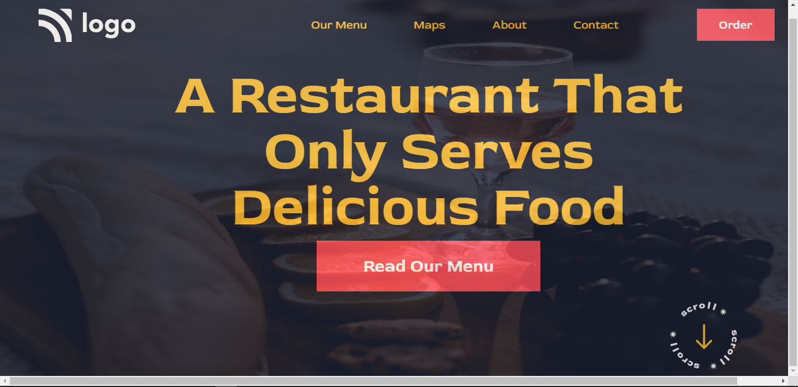

# Second Website in pure HTML and CSS
---
## Description 
The second project of the assignment of INeuron is made for the restaurant business in pure HTML and CSS. The overall time took to complete this project was around `3-4 hours`. The effort in this project was for navbar and the image positioning including multiple button positioning. We need to add background image to the entire webpage that should not only be in scale but also with less transperancy so that the menu items, navbar and all other elements should be visible on top of that background image.

---
<!-- PROJECT LOGO -->
 

  

<h3 align="center">Project 01</h3>

  
   
    <a href="https://harshalverma-project02.netlify.app/">View Live Demo</a>
  

<!-- ABOUT THE PROJECT -->

## About The Project

Here's a Screen-Shot of my first project and I learnt Most of my usefull Future of `HTML` and `CSS`.
 
 

## Built With

**Using Technologies**

1. `HTML`
2. `CSS`
3. `MarkDown`

> The challenge of this project was to design the page as it is from scratch with pure CSS without using any frameworks.

 

## Live Project

This project is presently deployed in **`Netlify Service`**.

[Live Project URL](https://harshalverma-project02.netlify.app)
 

<!-- LEARNT -->
 

## Learnt
In This project I learnt the following properties of HTML and CSS.
- Iecting background via 'url' function through CSS.
- Designing navbar and custom button.
- Deal with the screen size for the background image.
- Setting up the proper opacity where all the navbar and menu should be visible in the webpage.

 
<!-- CONTACT -->

## Contact

- **Name 👨‍💻:** [Harshal Verma](https://github.com/harshalvrm)
- **Email 📧:** [harshalvrm3@gmail.com](mailto:harshalvrm3@gmail.com)
- **Blog 📝:** [Hashnode blog](https://xadai.hashnode.dev/)

[Project 2 Link](https://harshalverma-project02.netlify.app)

